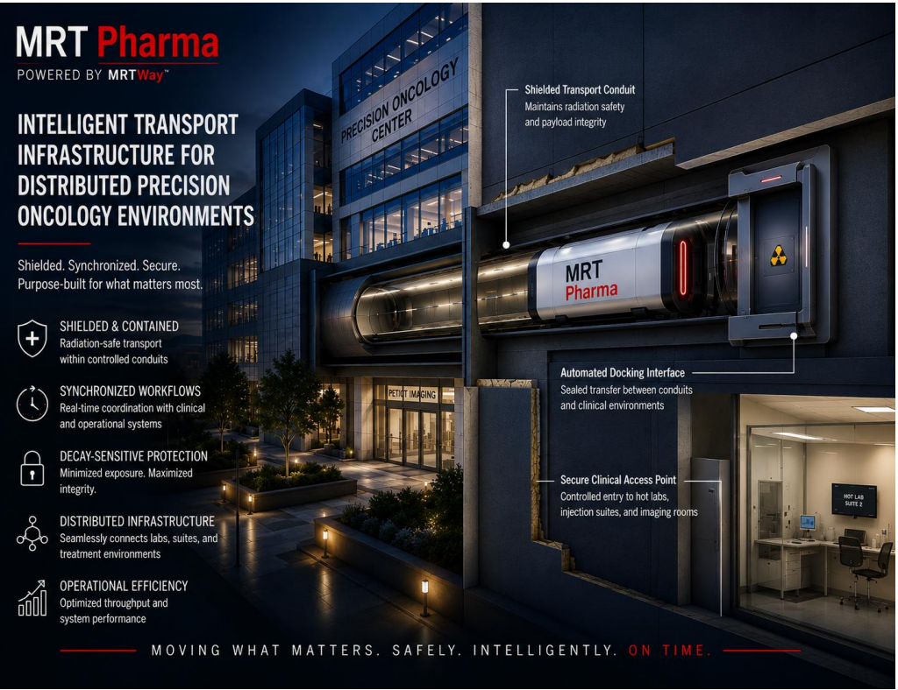

# MRT Pharma
### Infrastructure for Distributed Precision Oncology

MRT Pharma is a transport and logistics infrastructure concept focused on the automated movement of critical materials across healthcare, industrial, and urban environments.

The initial focus is precision oncology infrastructure, beginning with radiopharmaceutical logistics and the movement of time-sensitive medical materials. These materials often require fast, reliable, traceable, and low-handling transport between production, preparation, imaging, treatment, and disposal points.

Vision

MRT Pharma explores how advanced transport architectures, automation, data-driven operations, and controlled-environment logistics can improve the movement of high-value and time-sensitive materials.

The broader objective is to develop infrastructure that improves how critical healthcare resources are transported, monitored, and delivered.

These initial applications serve as early deployment pathways for technologies that may ultimately support larger automated logistics networks capable of moving high-value materials across hospitals, cities, and metropolitan regions.

Over the long term, MRT Pharma aims to contribute to a new generation of intelligent logistics infrastructure that combines automation, advanced transport technologies, and data-driven operations.

Initial Application Areas

* Radiopharmaceutical logistics with MRTPharma
* Precision oncology infrastructure
* Controlled-environment material handling
* Hospital and healthcare logistics
* Cleanroom-compatible transport systems
* Future urban and intercity micro-logistics networks

Current Stage

MRTWay is currently in the concept development, research, and venture-building stage with MRT Pharma as a use case for Radiopharmaceutical logistics and Precision oncology infrastructure.

Current activities include:

* System architecture development
* Infrastructure and workflow analysis
* Commercialization planning
* Healthcare stakeholder engagement
* Intellectual property development
* Precision oncology infrastructure research

Founding Team

Paul Osekirere Onaodowan

Founder & CEO

Engineer, entrepreneur, and technology innovator with experience spanning industrial infrastructure, refinery operations, data analytics, engineering management, startup development, and technology commercialization.

Dr. Ejiro E. Akpovwovwo

Co-Founder

Doctor of Pharmacy with more than 15 years of healthcare and pharmaceutical experience. His background includes pharmacovigilance, medication safety, healthcare operations, regulatory compliance, stakeholder engagement, and business analytics. He provides clinical insight and healthcare domain expertise supporting MRTWay’s work in precision oncology infrastructure and radiopharmaceutical logistics.

Long-Term Innovation Thesis

MRTWay is founded on the belief that future healthcare, industrial, and urban systems will require new infrastructure capable of moving critical materials more efficiently, safely, and intelligently.

Beginning with precision oncology infrastructure and radiopharmaceutical logistics, MRTWay seeks to explore technologies that may eventually support broader automated logistics platforms connecting hospitals, cities, and metropolitan regions.

Note

This repository is intended as a public-facing overview of the MRTWay vision and venture. Proprietary technical details, patent-sensitive information, and confidential system architectures are intentionally omitted.

## Documents

### [Strategic Infrastructure Brief](Strategic%20Radiopharmaceutical%20Logistics%20Brief.pdf)
A detailed overview of the MRT Pharma concept, the radiopharmaceutical logistics challenge, infrastructure considerations, and long-term vision.

### [Investor Presentation](MRTWay_Deck.pdf)
An overview of the MRTWay and MRT Pharma opportunity, including the problem, solution, market rationale, business model, and roadmap.
